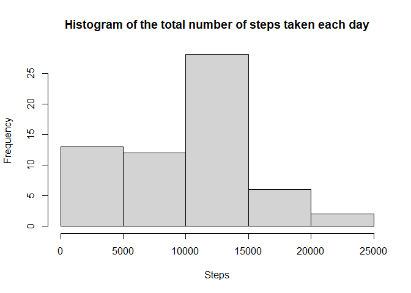
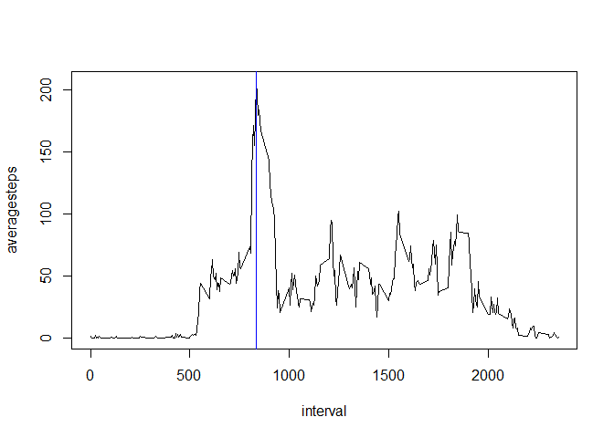
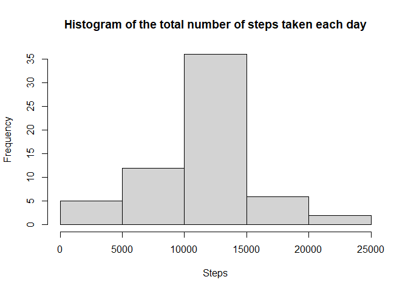
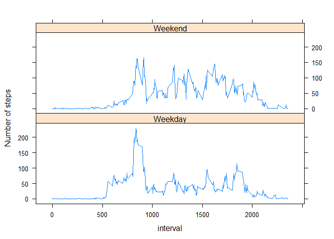

## Loading and preprocessing the data


```r
library(dplyr)
```

```
## 
## Attaching package: 'dplyr'
```

```
## The following objects are masked from 'package:stats':
## 
##     filter, lag
```

```
## The following objects are masked from 'package:base':
## 
##     intersect, setdiff, setequal, union
```

```r
rawdata <- read.csv('activity.csv')
rawdata <- mutate(rawdata, date = as.Date(date))
```
The raw data is read into a data frame and the date collumn is changed to Date class.

## What is mean total number of steps taken per day?
The total number of steps is calculated for each day, followed by the mean and median. 


```r
stepsperday <- rawdata %>% 
        group_by(date) %>% 
        summarise(totalsteps = sum(steps, na.rm = T))
```

```
## `summarise()` ungrouping output (override with `.groups` argument)
```

```r
hist(stepsperday$totalsteps, main = 'Histogram of the total number of steps taken each day', xlab = 'Steps')
```

<!-- -->

A histogram of total number of steps per day.


```r
stepsmean <- mean(stepsperday$totalsteps)
stepsmedian <- median(stepsperday$totalsteps)
```

The mean and median of the total number of steps per day is 9354.2295082 and 10395, respectively. 

## What is the average daily activity pattern?


```r
stepsperinterval <- rawdata %>% 
        group_by(interval) %>% 
        summarise (averagesteps = mean(steps, na.rm = T))
```

```
## `summarise()` ungrouping output (override with `.groups` argument)
```

```r
with(stepsperinterval, {
        plot(interval, averagesteps, type = "l")
        maxstepsinterval <<- stepsperinterval[which(averagesteps == max(averagesteps)), 1]
        abline(v = maxstepsinterval, col = 'blue')
}        
)
```

<!-- -->

A time series plot of the 5-minute interval (x-axis) and the average number of steps taken, averaged across all days is plotted. The 5-minute interval, on average across all the days in the dataset, that contains the maximum number of steps is 835.  

## Imputing missing values


```r
totalna <- sum(is.na(rawdata$steps))
```
Total number of missing values is 2304. 


```r
newsteps <- rawdata$steps
for (i in 1:length(newsteps)){
        
        if (is.na(newsteps[i])){ 
                newsteps[i] <- as.numeric(stepsperinterval[stepsperinterval$interval == rawdata[i, 3], 2])
        
        }
}
newdata <- mutate(rawdata, steps = newsteps)
```
A vector (newsteps) is created containing values from 'steps' in raw dataset, and if the value is NA, it is replaced with the mean for that 5-minute interval. Then, newsteps vector is used to create a new dataset by replacing the old 'steps' collumn from the raw dataset. 


```r
newstepsperday <- newdata %>% 
        group_by(date) %>% 
        summarise(totalsteps = sum(steps, na.rm = T))
```

```
## `summarise()` ungrouping output (override with `.groups` argument)
```

```r
newstepsmean <- mean(newstepsperday$totalsteps)
newstepsmedian <- median(newstepsperday$totalsteps)
hist(newstepsperday$totalsteps, main = 'Histogram of the total number of steps taken each day', xlab = 'Steps')
```

<!-- -->

A histogram of the total number of steps taken each day. The mean and median total number of steps taken per day is 1.0766189\times 10^{4} and 1.0766189\times 10^{4}, respectively. The impact of imputing missing data is that values has taken the shape of a normal distribution where mean = median. 

## Are there differences in activity patterns between weekdays and weekends?


```r
library(lattice)

day <- weekdays(newdata$date)
for (i in 1:length(day)){
        if (day[i] == 'Saturday' | day[i] == 'Sunday'){
                day[i] <- 'Weekend'
        } else { day[i] <- 'Weekday'}  
}

newdata2 <- newdata %>% 
        mutate(day = day) %>% 
        group_by(day, interval) %>% 
        summarise(average = mean(steps))
```

```
## `summarise()` regrouping output by 'day' (override with `.groups` argument)
```
A new variable (day) is created to indicate if the day is a "weekday” or “weekend”. This variable is used to group the data and calculate average steps per interval based on the type of day. 


```r
xyplot(average ~ interval | day, data = newdata2, type= 'l', layout = c(1, 2), ylab = 'Number of steps')
```

<!-- -->

A panel plot containing a time series plot of the 5-minute interval (x-axis) and the average number of steps taken, averaged across all weekday days or weekend days (y-axis) is plot. 
